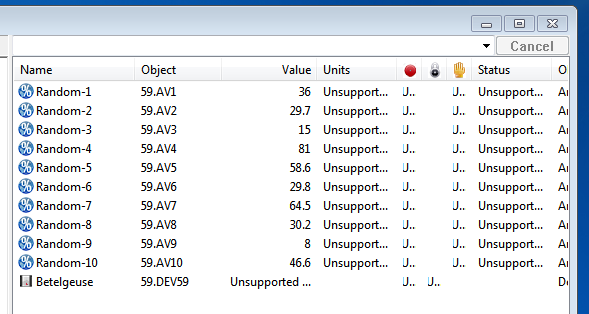

.. BACpypes sample code 4

Sample 4 - Extending Objects and Properties
===========================================

This sample application shows how to extend one of the basic objects, an Analog
Value Object in this case, to provide a custom property - present value.
This type of code is used when the application is providing a BACnet interface
to a collection of data.  It assumes that almost all of the default behaviour
of a BACpypes application is sufficient.

.. note::

    The code in this description starts at the __main__ block and goes 
    backward through the source file - RandomAnalogValueObject.py.

Constructing the Device
-----------------------

Initialization is simple, the simple BACnet/IP application, which includes the
networking layer and communications layers all bundled together is created
like the other samples::

    # make a sample application
    thisApplication = BIPSimpleApplication(thisDevice, config.get('BACpypes','address'))

The only object by default is an instance of :class:`object.LocalDeviceObject`.  
The next step is to create a special Analog Value Object and add it to the application::

    # make a random input object
    raio = RandomAnalogValueObject(objectIdentifier=('analog-value', 1), objectName='Random')

    # add it to the device
    thisApplication.AddObject(raio)

Adding the object not only makes it addressable by BACnet clients, but also
appends its object identifier to the list of object identifiers in the
**object-list** property of the device object.  This makes the object 
:term:`discoverable` by BACnet configuration tools.

All objects must have an object identifier and an object name, so they are
passed as keyword arguments.  All of the keyword arguements are matched with
an appropriate property in the :func:`object.Object.__init__` method, which
will make sure the keyword argument value is appropriate for the property.

Extending the Analog Value Object
---------------------------------

The definition of a new kind of Analog Value Object uses Python inheritance,
so it seems fairly simple::

    class RandomAnalogValueObject(AnalogValueObject):
        properties = [
            RandomValueProperty('present-value'),
            ]

    register_object_type(RandomAnalogInputObject)

But the call to register the object type has lots of side effects.  First,
there is already a call to register the built-in :class:`object.AnalogValueObject`
so this registration is going to override it.

.. note::

    Overriding the same base type, like AnalogValueObject, in more than one 
    way could be difficult in some kinds of gateway software which may require
    re-factoring the :func:`object.get_object_class` and the 
    :func:`object.get_datatype` functionality.

The first part of :func:`object.register_object_type` builds a dictionary of
the relationship between the property name and its associated instance.  It will
look for *properties* class attribtues in the entire inheritance tree (using 
the method resolution order) but only associate the first of two instances 
with the same name.

So in this case, the RandomValueProperty instance called 'present-value' will 
be bound to the object type before the built-in version finds it in the
*properties* list in the :class:`object.AnalogValueObject`.

A New Real Property
-------------------

BACnet clients expect the 'present-value' of an Analog Value Object
to be :class:`primitivedata.Real` and returning some other datatype would 
seriously break interperabililty!  Initialization is almost identical
to the one for the built-in AnalogValueObject::

    class RandomValueProperty(Property, Logging):

        def __init__(self, identifier):
            Property.__init__(self, identifier, Real, default=None,
                optional=True, mutable=False
                )

The only difference is *mutable* is ``False``, which means BACnet clients will
receive an error if they attempt to write a value to the property.

The core of the application is responding to a ReadPropertyRequest
(mapped to a ReadProperty function call)::

    def ReadProperty(self, obj, arrayIndex=None):

        # access an array
        if arrayIndex is not None:
            raise Error(errorClass='property', errorCode='property-is-not-an-array')

The **arrayIndex** parameter is an integer value if the BACnet client is
accessing the property as an array, which is an error.  Now it comes down to
getting a random value and returning it::

        # return a random value
        value = random.random() * 100.0
        RandomValueProperty._debug("    - value: %r", value)

        return value

The value returned by this function will be passed as an initial value to 
construct a :class:`primitivedata.Real` object, which will then be encoded 
into the :class:`apdu.ReadPropertyACK` response and returned to the client.

Running the Application
------------------------

::

    $ python RandonAnalogValue.py
    
Then using a BACnet client - like an OWS (Operator Workstation) or BACnet exploration 
tool, read the application's Analog Value Objects.  Notice: the value of the Present Value 
property changes each time it is read by the client tool.

